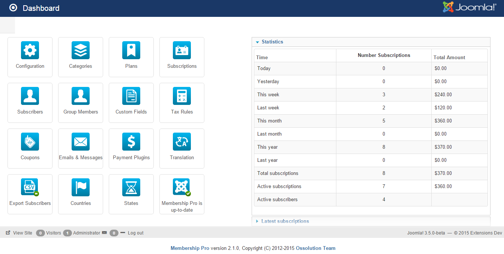
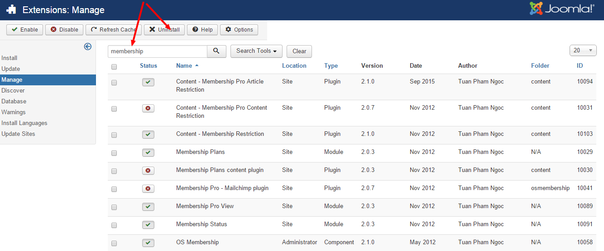

## Installation
When you purchase Membership** Pro** extension from our site, you will receive an email contain the extension in a zip file called **com_osmembership.zip**. The component, all the modules and plugins are included in this single zip file. The installation process is simple, it can be installed in the same way with you install any other Joomla extensions:

1. Login to back-end of your site using a super administrator account.
2. Access to **Extensions => Manage => Install** menu item.
3. Browse for the file **com_osmembership.zip**.
4. Click on **Upload & Install** button

After the installation process completed, you will be redirected to dashboard screen to start configuring and settting up the extension.

## Check for new version

To see whether your site is running on latest version of Membership Pro or not, you can go to **Membership Pro => Dashboard**,  look at the update notification icon at the bottom right (see the screenshot below):

1. If you are using latest version, you will see this text : **Membership Pro is up-to-date**. In this case, no update is require.
2. If your site is not running latest version, you will see the text like this: **Membership Pro 2.1.0 Update now!**. In this case, your site is running an out-dated version and you should download latest version to update to your site. To download latest version, go to [http://joomdonation.com](http://joomdonation.com), login to your account, then access to [My Downloads](http://joomdonation.com/my-downloads.html) menu item, download latest version and follow the instruction in Upgrade section below to upgrade it to your site.

## Upgrade
The process for upgrading Membership Pro to latest version is the same with new installation. Please note that:

1. Please don't uninstall old version before installing new version. It is not needed. Further more, if you uninstall the old version before upgrading, you will have to re-create the menu items which you created to link to the extension before.
2. Before updating the extension to latest verison, you should make a backup copy of your site so that in case something goes wrong (for any reasons), you can roll back to earlier status. We suggest you to install [Akeeba Backup](https://www.akeebabackup.com/products/akeeba-backup.html) extension and make a backup of your site before upgrading

## Uninstall
If you have to uninstall Membership Pro for some reasons (for example, you want starts from scratch - or maybe after installing and using it, you realize that it doesn't meet your requirement), you can follow the instructions below to get the extension completely uninstalled:

1. Login to backend of your site using a super admin account
2. Access to Extensions => Manage => Manage menu item.
3. Enter membership keyword into the search box to search for membership pro component and all it's modules, plugins (see the screenshot)
4. Check on the items you want to un-install (look at Author column, it must be **Tuan Pham Ngoc** to make sure the extension belong to **Membership Pro** package)
5. Click on **Uninstall** button in the toolbar

>>>>> When you uninstall Membership Pro, the database tables related to the extension won't be uninstalled. By doing that, when you re-install the extension in the future, all the old data will be kept and still be available. If you want to completely removing it, please access to your site database via phpmyadmin, look at all the tables with prefix __osmembership__ and drop these tables