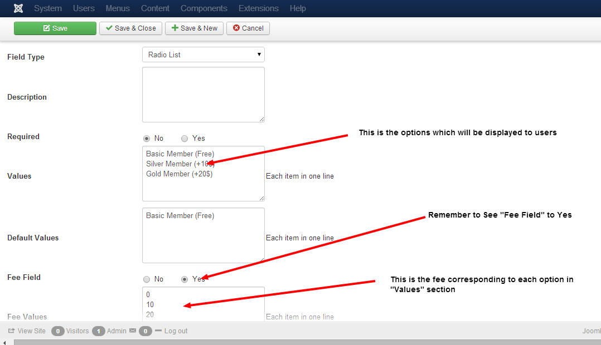

Custom Fee Fields is a powerful feature in Membership Pro. It allows you to charge your subscribers additional fee (beside the subscritpion plan price) depends on the value(s) they enter/selected on a field on subscription form. If you use custom fee field feature, please remember the following rules:

1. Only the custom fields has **Fee Field** property set to **Yes** will be used to calculate fee for the subscription. 
2. Custom Fee Fields only works for the following custom field types: **List (Single + Multiple Select), Checkboxes, Radio and Textbox**.
3. On a subscription form, there can be multiple custom fee fields. **TOTAL AMOUNT SUBSCRIBER HAS TO PAY FOR THE SUBSCRIPTION = THE PRICE OF SUBSCRIPTION PLAN + SUM OF ALL FEE FIELDS**.

## Radio List + Single Dropdown Custom Field Type
Let says you are creating a custom field which allow subscribers to choose membership type on your site. So you create a custom field with following parameters:

1. Values : **Basic Member (Free)**, **Silver Member (+10$)**, **Gold Member (+20$)**. Each item in one line.
2. Default Values : **Silver Member (+10$)**.
3. Fee Values : **0, 10, 20** . Each item in one line. 
4. Field Type : **Radio List**.
5. Fee Fied: must set to **Yes**

In the front-end , the system will display a radio custom field with 3 options : Basic Member (Free), Silver Member (+10$), Gold Member (+20$)

With the above settings:

1. If subscribers choose **Basic Member** , they won't have to pay any additional fee.
2. If subscribers choose **Silver Member** option, they will have to pay additional **10$**. 
3. If subscribers choose **Gold Member** option, they will have to pay additional **20$**.

Please note the mapping 1-1 between **Values** and **Fee Values** settings of the custom field. Basic Member (Free) mapped To 0 . Silver Member (+10$) mapped to 10. Gold Member mapped to 20.

## Checkboxes + MultiSelect Custom Field Type

You can setup a same field as Radio Custom Fee field mentioned above. The only difference is the way the fee is calculated. For **Checkboxes** and **MultiSelect** custom field, the fee which subscribers will be charged will be total fee of all selected options. For example, with the above setup:

1. If subscribers If users select **Basic Member** , they won't have to pay any additional fee.
2. If subscribers select **Silver Member** option, they will have to pay additional **10$**. 
3. If subscribers select **Gold Member** option, they will have to pay additional **20$**.
4. If subscribers select both Silver Member and Gold Member, they will have to pay additional **30$** (10$ for Silver Member and 20$ for Gold Member).

## Textbox Custom Field Type

Let say you want to create a text field called Donation to allow subscribers to make additional donation for you (beside paying for their subscription fee). You can then create a new custom field with the following setting:
1. **Name** : osm_donation_amount
2. **Title**: Donation Amount
3. **Field Type**: **Text**
4. **Fee Formula**: **[FIELD_VALUE]**
5. **Fee Fied**: **Yes**.

Now, any value subscribers enter into this field will be added to total subscription fee which subscribers have to pay. For example, if they enter 10, 10$ will be added to total subscription fee, if they enter 20, 20$ will be added to total subscription fee and so on. As you can see **[FIELD_VALUE]** will be replaced with the value users entered in the field for calculating the fee in Fee Formula.

## Understand Fee Formula

Fee Formula is a bit difficult to understand. However, once you get it, you will see that is is very powerful for fee calculation.
1. You can use **math operators : +, -, * , /** in the fee formula.
2. When you use **[FIELD_VALUE]** tag in the fee formula, it will be replaced with the actual fee associated with that field for fee calculation:
* If the field is a Text custom field, **[FIELD_VALUE]** will be replaced with the value subscribers enter on the textbox.
* If the field is a single select field (Radio, Single Select box), **[FIELD_VALUE]** will be replaced with the fee** amount corresponding with the value** subscribers select for the field.
* If the field is a multiple select field (Checkboxes, Multiple Select), **[FIELD_VALUE]** will be replaced with the total** fee values of all the options** which users select for that field.  
3. You can also use a custom fee in fee formular with the syntax: **[NAME_OF_CUSTOM_FIELD_IN_UPPERCASE]**. For example, if you have a textbox custom field called osm_quantity to allow users to enter quantity of the items they want to purchase, you can use the tag **[OSM_QUANTITY]** in the fee formula of any custom fields. Please note that when you use a custom field in fee formula, **it will be replaced with a value using the same rules with [FIELD_VALUE] tag mentioned above**.