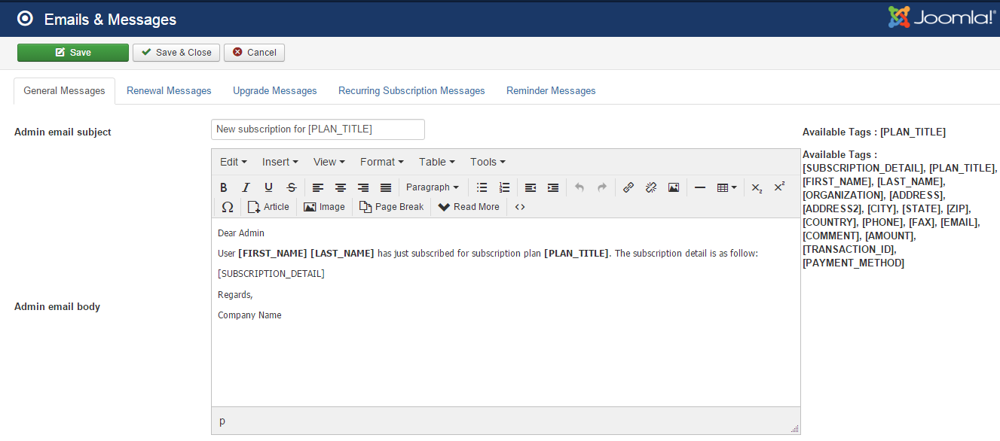

When you install Membership Pro, Membership Pro will generate default **English Messages** which will be used to display on **subscription form**, display on **subscription complete page**, display in **emails**.....

These messages are configurable in the system. You should review all of these generated messages and change it to meet your need if needed, especial when you use a none English language on your site.

To see the messages and change it to meet your need, there are 3 ways:
1. Access to **Components => Membership Pro => Emails & Messages**
2. Access to Membership Pro Dashboard, then click on **Emails & Messages** icon.
3. On any pages in Membership Pro, access to **Setup => Emails & Messages** menu item.

## General Messages

1. **Admin email subject**: Subject of the notification email sent to admin when someone sign up for a subscription plan.
2. **Admin email body**: Message of the notification email sent to admin when someone sign up for a subscription plan.
3. **User email subject**: Subject of the confirmation email sent to subscriber after he sign up for a subscription plan.
4.  **User email body**: Message of the confirmation email sent to subscriber after he sign up for a subscription plan.
5.  **User email body (offline payment)**: Message of the confirmation email sent to subscriber after he sign up for a subscription plan using **offline payment** method.	
6.  **Subscription approved subject**: Subscription of the notification email sent to subscriber when admin approve his subscription record (change the status from Pending to Active, usually when he uses offline payment method for the subscription)
7.  **Subscription approved body**: Message of the notification email sent to subscriber when admin approve his subscription record (change the status from Pending to Active, usually when he uses offline payment method for the subscription)
8.  **Subscription Form Message**: Message display above subscription form when subscribers sign up for a subscription plan
9.  **Thank you message**: The message display to subscribers after they complete signin up for a subscription plan
10.  **Thank you message (offline payment)**: The message display to subscribers after they complete signin up for a subscription plan using offline payment method.
11.  **Content Restricted Message**: The message display to users when they access to an article which has content restricted - we will come back to this item later in this document

## Renewal Messages

This section content the messages which will be used when subscribers renew their membership in **Membership Pro**

1. **Subscription Renew Form Message** : Message display above subscription form when subscribers renew their membership
2. **Subscription renewal Admin Email Subsject**: Subject of the notification email sent to admin when a subscriber renew his membership
3. **Subscription renewal Admin Email Body**: Message of the notification email sent to admin when a subscriber renew his membership
4. **Subscription renewal user email subject**: Subject of the confirmation email sent to subscriber after he renew his membership
5. **Subscription renewal user email body**: Message of the confirmation email sent to subscriber after he renew his membership
6. **Subscription renewal user email body (offline payment)**: Message of the confirmation email sent to subscriber after he renew his membership using offline payment method.
7. **Subscription renewal thanks message**: The message display to subscribers after they complete renewing their membership
8. **Subscription renewal thanks message (offline payment)**: The message display to subscribers after they complete renewing their membership using offline payment method.

## Upgrade Messages

This section contains the messages which will be used when subscribers upgrade their membership from one plan to another (higher level) plan

1. **Subscription Upgrade Form Message**: Message display above subscription form when subscribers upgrade their membership
2. **Subscription upgrade Admin Email Subsject**: Subject of the notification email sent to admin when a subscriber upgrade his membership
3. **Subscription upgrade Admin Email Body**: Message of the notification email sent to admin when a subscriber upgrade his membership
4. **Subscription upgrade user email subject**: Subject of the confirmation email sent to subscriber after he upgrade his membership. 
5. **Subscription upgrade user email body**: Message of the confirmation email sent to subscriber after he upgrade his membership. 
6. **Subscription upgrade thanks message**: The message display to subscribers after they complete upgrading their membership

## Recurring Subscription Messages

This section contains the messages which will be used when payment for a recurring subscription (not at the time subscriber sign up but from the second payment in the payment cycble for recurring subscriptions)

1. **Recurring subscription cancel message**: The message display to subscriber when he cancels his recurring subscription
2. **User recurring subscription cancel email subject**: Subject of the confirmation email sent to subscriber after he cancel his recurring subscription.
3. **User recurring subscription cancel email body**: Message of the confirmation email sent to subscriber after he cancel his recurring subscription.
4. **Admin recurring subscription cancel email subject**: Subject of the notification email sent to admin when subscribers cancel their recurring subscription.
5. **Admin recurring subscription cancel email body**: Message of the notification email sent to admin when subscribers cancel their recurring subscription.

## Reminder Messages

This section contains the messages use to send to subscribers to notify them before their subscription expired. Right now, Membership Pro allows sending up to 3 reminder emails before subscription expired

1. **First Reminder Email Subject**: Subject of the first reminder email sent to subscribers.
2. **First Reminder Email Body**: Message of the first reminder email sent to subscribers.
3. **Second Reminder Email Subject**: Subject of the second reminder email sent to subscribers.
4. **Second Reminder Email Body**: Message of the second reminder email sent to subscribers.	
5. **Third Reminder Email Subject**: Subject of the third reminder email sent to subscribers.
6. **Third Reminder Email Body**: Message of the third reminder email sent to subscribers.

