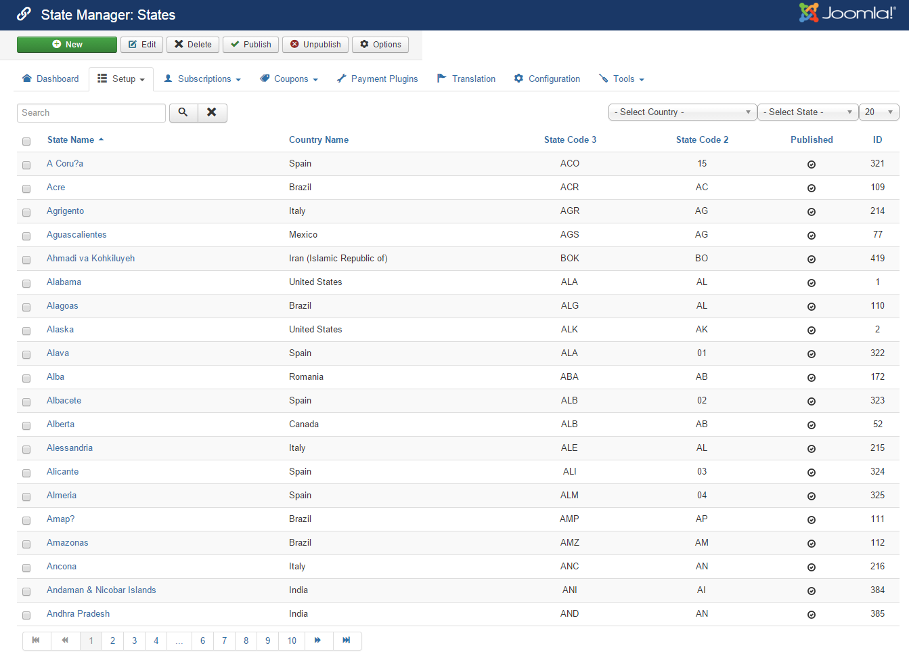

In a typical setup, on subscription form of Membership Pro, there are two **special fields**

1. A **country field** which displayes list of countries to allow subscribers to choose their country
2. A **state field** which dislayes list of states from the selected country. When the country is changed, the list of states in the state field will also be updated / changed automatically

Sometime, you might want to add, update, remove a country or state to meet your own need. If so, please go to **Membership Pro => Countries** and **Membership Pro => States** to update the countries / states list which you want to use in your setup

