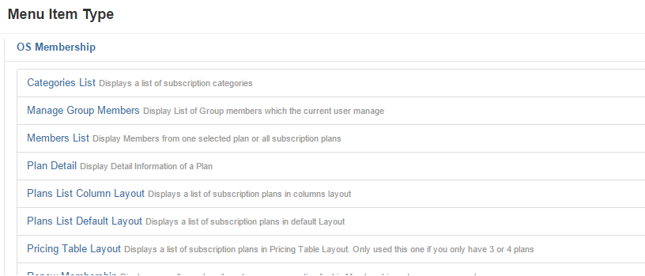
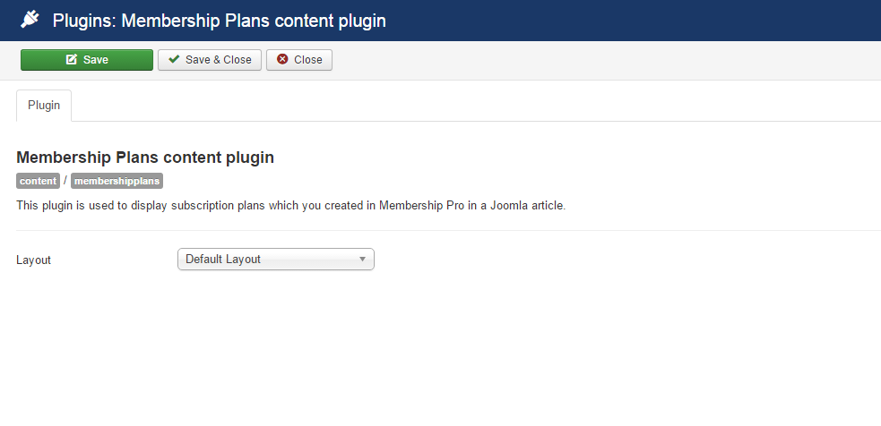

## Using Menu Items
In Membership Pro (and Joomla), the most common ways to display something to frontend users is creating menu items. If you don't know how to create a menu item, please read the instructions at [Adding a new menu item](https://docs.joomla.org/Adding_a_new_menu_item)

To allow users to see and sign up for your subscription plans, you can use the following menu options:
1. **Categories List**: Use this menu option if you have setup categories in your system and want users to be able to see these categories. When users on categories list page, they can click on a category to see it's sub-categories and  all plans assigned to that category.
2. **Plans List Default Layout**: Use this menu option if you want to display list of plans (from all or a selected category) in grid format. See [http://membershippro.joomservices.com/](http://membershippro.joomservices.com/) to see how subscription plans are displayed using **Default Layout**.
3. **Plans List Columns Layout**: Use this menu option if you want to display list of plans (from all or a selected category) in column format. See [http://membershippro.joomservices.com/membership-plans/plans-columns-layout](http://membershippro.joomservices.com/membership-plans/plans-columns-layout) to see how subscription plans are displayed using **Columns Layout**.
4. **Pricing Table Layout**: Use this menu option if you want to display list of plans (from all or a selected category) in column format. See [http://membershippro.joomservices.com/membership-plans/pricing-table-layout](http://membershippro.joomservices.com/membership-plans/pricing-table-layout) to see how subscription plans are displayed using Pricing Table Layout
5. **Plan Details**: Use this menu option if you want users to see plan details information while accessing to this menu item. From this page, users can click on Sign up button to subscribe for the plan.
6. **Subscription Form**: Use this menu option if you want users to see subscription form of the selected plan while accessing to this menu item.

## Using Modules

Beside using menu items, you can also display subscription plans to end-users use **Membership Plans** module. Below are the parameters which you can setup when using the module:
1. **Layout**: Select the layout you want to use to display plans from module. There are 3 layouts available: **Default Layout**, **Columns Layout** and **Pricing Table Layout**.
2. **Plan Ids**: Enter Ids of the subscription plans you want to display in the module, command separated. For example, if you want to display two modules with ID = 1 and ID = 3, just enter **1,3** into this parameter. If you leave this parameter empty, all the published plans will be displayed

## Display Subscription Plans in a Joomla article

If you want to display subscription plans in a Joomla aritlc, you can use **Membership Plans content plugin**

1. Go to **Extensions -> Plugins**, find the plugin **Membership Plans content plugin**, click on it to edit. Choose the layout you want (default, columns or pricing table layout) in **Layout** parameter. Remember to change the Status to **Enabled**, then press Save button in the toolbar
2. Now, edit the article you want to display subscription plans, using the syntax below:
* {membershipplans ids="*"} => it will display all published plans in the article.
* {membershipplans ids="cat-3"} => It will display all subscription plans from the category with ID = 3
* {membershipplans ids="2,4,5"} => It will display all subscription plans with ID = 2, 4, OR 5.

