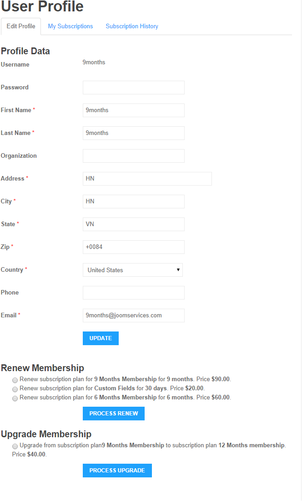

## User Profile

You can setup a menu item to link to **User Profile** view of **Membership Pro** to allow subscribers to access to his profile so that:
1. He can update his profile information (including account username / password). When he updates his profile data, these profile data will be syncronized to all of his subscription records.
2. He can see his subscription history (all subscription records), his subscriptions (list of plans which he subscribed, and when it will be expired..)
3. He can renew his membership (if there are renew options available)
4. He can upgrade his membership (if there are upgrade options available)
5. **He can cancel recurring subscription**: To cancel recurring subscription, he need to access to My Subscriptions tab, click on **Cancel subscription** button nex to the subscription he want to cancel to get it cancelled. Please note that, a recurring subscription can only be cancelled from user profile page if he signed up using one of the below payment plugins: **Paypal Pro, Authorize.net, Stripe**. If he signs up for the plan using a different payment method, the  **Cancel subscription** won't be available (because the other payment gateways doesn't have API to allow us to call to cancel the subscription from within the site)

## Renew Membership menu item

Beside renew membership from user profile page, you can also create a menu item to link to **Renew Membership** view of Membership Pro. When subscribers access to that menu item, they will see list of renew options available, select the renew option they want and process renew membership.

## Upgrade Memership menu item

Beside upgrade membership from user profile page, you can also create a menu item to link to **Upgrade Membership** view of Membership Pro. When subscribers access to that menu item, they will see list of upgrade options available, select the upgrade option they want and process upgrading membership.