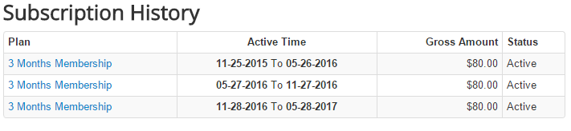

If you want your subscribers to see their subscription history, you can create a menu item to link to **Subscription History**. When subscriber access to this menu item, he will see list of subscription records which he signed up on your site. He can also click on a subscription record to see details information of the record.

