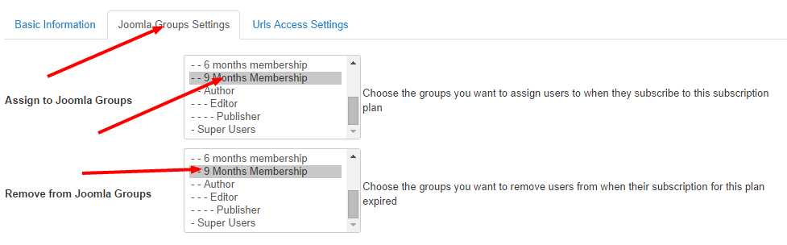

This is a common usage in **Membership Pro**. Usually, you will want that when users sign up for a subscription plan, they will be assigned to the **Joomla group(s)** you want so that you can use Joomla core ACL to give them permissions to perform some actions or access to restricted resources on your site (of course, these resources are not available for public and normal registered users). Please follow the steps below to setup it if you want to have this feature:
1. Login to back-end of your site as a super admin account.
2. Access to Users -> Groups, Create a new Joomla group on your site, maybe calling that group as **Subscriber**. This group should be child group of **Registered** group
3. Go to **Extensions -> Plugins**, find and publish the **OS Membership - Joomla Groups** plugin
4. Now, when you add/edit a subscription plan, you will see a new tab called **Joomla Groups settings**. On this tab, you will see three settings:
* **Assignto Joomla Groups**: Choose the Joomla groups you want subscribers will be assigned to when they sign up for this subscription plan. For example, in this case, you can choose **Subscriber** group which you just created
* **Assign to Joomla Groups when subscription expired**: Choose the Joomla groups you want to assign subscribers to when their subscription for this plan is expired.
* **Remove from Joomla Groups**: Choose the Joomla groups whcih you want subscribers of this plan will be removed from when their subscription for this plan is expired. Usually, it should be the same with the groups you selected in **Assign to Joomla Groups** setting.

With the above setup, when subscribers sign up to this subscription plan, they will be assigned to **Subscriber** group and they can access to the resources which you give to **Subscriber** group. When their subscription for this plan is expired, they will be removed from **Subscriber** group, thus they cannot access to these resources anymore (unless they renew their membership).

If you want to restrict access to resouces based on Joomla core ACL (you need to understand how Joomla ACL works), this will be a very powerful and flexible plugin.

