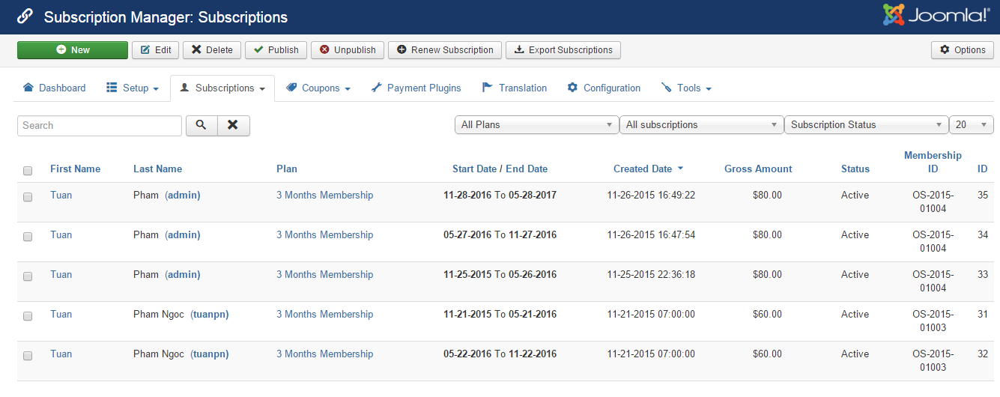

To access to subscriptions management page, there are 3 different ways:

1. Access to **Components => Membership Pro -> Subscriptions**
2. Access to Membership Pro Dashboard, then click on **Subscriptions** icon
3. On any pages in Membership Pro, access to **Subscriptions => Subscriptions**

From this page, you can see list of subscription records, filter subscription records by plans, by subscritpion status, by subscription type (new subscription, Subscription Renewal, Subscription Upgrade)

## Add New Subscription Record

Press **New** button in the toolbar to add new subscription record. A form will be displayed to allow you enter  information for this subscription

1. When add new subscription record, you can choose an existing user or enter username and password to create a new user for the record.
2. You can leave the following information empty and it will be calculated automatically by the extension:
* Created Date
* Subscription Start Date
* Subscription End Date
* Net Amount
* Discount Amount
* Tax Amount
* Payment Fee
* Gross Amount