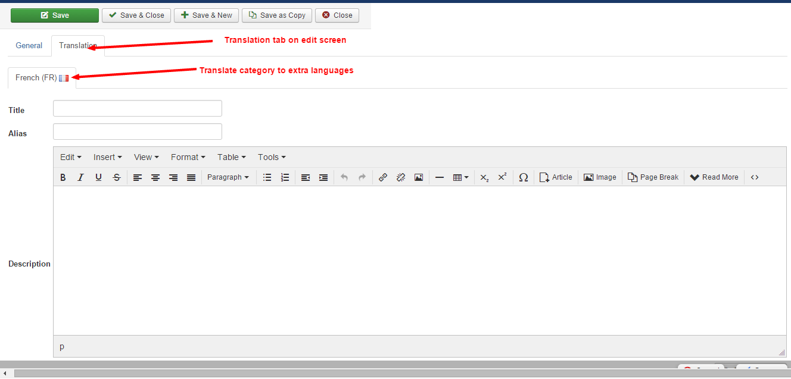

Membership Pro support multilingual out of the box, and I am proud to say that it is implemented in a better way than Joomla core. Basically, in Joomla core, for each item (for example, each article), you will have to setup different records, each record for one language

However, in Membership Pro, you will only have to create one record, then translate to different languages in Translation tab in add/edit record screen.

To setup Membership Pro on a multilgual website, you will need to do the translation on a different places below:

## Translate language items

To that, go to **Membership Pro => Translation**, translate the language items used in the extension to all languages used on your site

## Translate categories

If you use categories in your system, you need to translate categories. On Categoires Management screen, click on a category to edit. Look at **Translation tab**, translate the category to all other languages (beside default language) used on your site

## Translate plans

On Subscription Plans Management screen, click on a plan to edit. Look at **Translation tab**, translate the plan to all other languages (beside default language) used on your site.

## Translate Emails & Messages
The final part you have to translate is **Emails & Messages**. Access to **Membership Pro => Emails & Messages**, look at Translation tab, translate all the messages to all other languages (beside default language) used on your site.

>>>>>> Sometime, you might see an SQL error when your site is a multilingual website because the database tables lack some require fields to support multilingual. If that's the case, please access to **Tools => Fix Database Schema**. After that, the error should be gone.