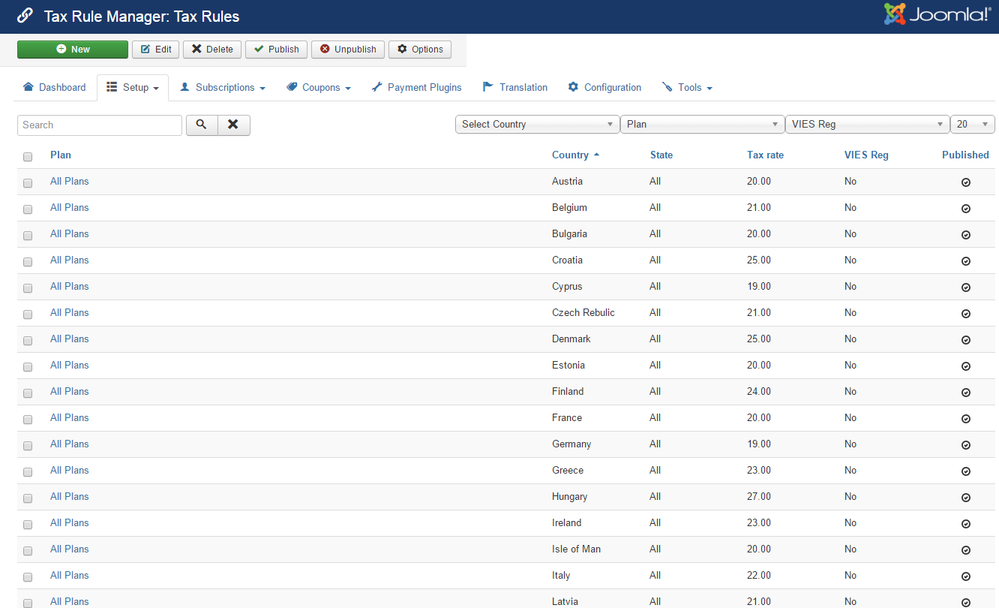

If you want to charge tax for subscriptions, you will need to setup tax rules. To access to **Tax Rules** management page, there are 3 different ways:

1. Access to **Components => Membership Pro => Tax Rules**.
2. Access to Membership Pro Dashboard, then click on **Tax Rules icon**.
3. On any pages in Membership Pro, access to Setup => **Tax Rules**.

## Add New Tax Rule
From Tax Rules Management screen, press New button in the toolbar to add a new tax rule. You will be presented with a screen below:

| Property | Description |
| ------ | ----------- |
| Plan   | Select the plan (or ALL Plans) this tax rule will be applied to.|
| Country   | Select the country (or **ALL**) this tax rule will be applied to.|
| State   | Select the state (or **N/A**) this tax rule will be applied to.|
| Tax rate   | Enter the tax rate for this rule. If you enter 0, no tax will be charged|
| VIES Reg   | This field is only avaialble if you are from an EU country. If set to Yes, this tax rule will be applied in case subscriber has a valid EU VAT Number. If set to No, this tax rule will be applied in case subscribers don't have a valid EU VAT Number|

## How Membership Pro determine a tax rule for a subscription

When subscribers entering subscription form to sign up, Membership Pro will try to find the best match tax rule to use for the subscription with the following priority:
1. **Base on plan**:
* If **there are tax rules for the current plan, these tax rules will be used** to get tax rate
* If **there are no specific rules for the current plan, the tax rules which are setup for all plans** will be used 
2. **Base on country**:
* If **there are tax rules for the country which subscriber select on subscription form, these tax rules will be used** to get tax rate.
* If **there is no rule for the country which subscriber select on subscription form, the tax rules which are setup for ALL COUNTRIES will be used** to get tax rate.
3. **Base on state**: In some country like US, Canada, you might have to setup tax rate based on the state subscribers select on subscription form:
* If **there are tax rules for that sepecific state, these tax rules will be used** to get tax rate
* If **there are no tax rules for that sepecific state, these tax rules which are setup for the country will be used** to get tax rate.
* If **there are no tax rules for that sepecific state and country, these tax rules which are setup for ALL COUNTRIES will be used** to get tax rate.

## Common Tax Rules setup
1. If you want to disable tax, please unpublish (or remove) all tax rules
2. If you want to have only one flat tax rate over the system, just create a tax rule with plan set to ALL, country set to ALL, state set to N/A and enter the tax rate you want.
3. If you want to have the same tax rate for all plans and a different tax rate for a specific plan, just create two tax rules:
* One tax rule has plan set to **ALL**.
* One tax rule has the plan set to the **specific plan** you want.
3. If you want to have the same tax rate for all counrties and a different tax rate for a specific country, just create two tax rules:
* One tax rule has country set to **ALL**.
* One tax rule has the country set to the **specific country** you want.
4. If you want to have different tax rates for different states in your country, just create two tax rules like this:
* One tax rule has country set to your country and has state set to N/A
* One tax rule has country set to your country and has state set to the specific state you want

## EU Tax Rules Builder

If you are from an EU country and need to setup tax rules, there will be many tax rules need to be created. However, don't worry, we have a tool to help you. Follow the steps below and you will have the tax rules setup and works property in Membership Pro and it is conform with EU Tax Rules:
1. Go to Membership Pro => Configuration, make sure you set Default Country config option to your country
2. You need to create a custom field to allow subscribers to enter EU VAT Number. Go to Membership Pro -> Create a text custom field, publish it.
3. Go to Membership Pro => Configuration, look at **EU VAT Number field** config option (at the right) and select the custom field which you setup in step #2 above
4. Access to Tools => Build EU Tax Rules. When you do that, all the necessary tax rules will be created and Membership Pro will calculate the tax rate for subscription follow the EU Tax Rules