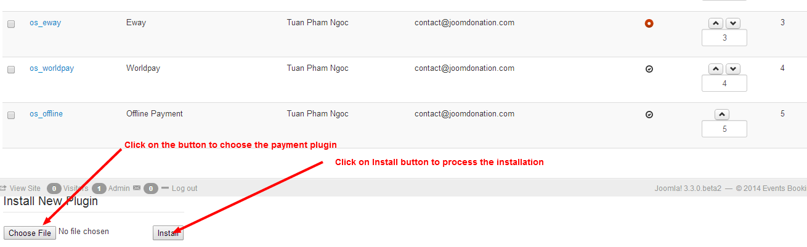
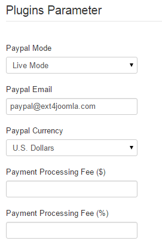
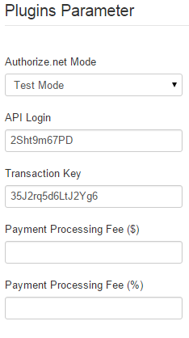

When subscribers sign up for your subscription plan, if the plan is a paid subscription plan (price > 0), subscribers will have to pay for the subscription to become active subscriber in the system.

In order to receiving online payment from your subscribers, you will need to config Membership Pro to use the payment plugins you want. When you install Membership Pro, there are 4 payment plugins installed with it by default: **Paypal** (Paypal payment standard), **Authorize.net** (AIM), **Eway** and **Offline Payment**.

To access to Payment Pluginsmanagement page, there are 3 different ways:
1. Access to Components** => Membership Pro => Payment Plugins**
2. Access to Membership Pro Dashboard, then click on **Payment Plugins** icon.
3. On any pages in Membership Pro, access to **Payment Plugins** menu item

>>>>> Right now, we only have 4 payment plugins support recurring payment feature. It is: Paypal, Paypal Pro, Authorize.net and Stripe. All other payment plugins only support onetime payment

>>>>> When subscribers sign up for a recurring subscription plan, only recurring payment plugins are available for them to select. For example, even you publish **offline payment** plugin, it will still not available on subscription form of recurring subscription plan because **offline payment** plugin doens't support recurring payment. Same for **Eway** and other payment plugins.

## Common Tasks

### Uninstall un-used payment plugins
It is very likely that you won't use all of the 4 payment plugins come with Membership Pro out of the box, so you will need to unpublish the one you don't want to use. There are two ways to unpublish a payment plugin:
1. Click on the **green (published) icon** in the Published column.
2. Check on the checkbox next to the payment plugin, then press **Unpublish** button in the toolbar.

### Change title of payment plugin

You might want to change the title of the payment plugin to make it easier to understand to your end users. For example, you might want to change the title from **Authorize.net** to **Creditcard**....

To change title of the payment plugin, please click on the payment plugin to edit, change the title to meet your need, then press Save button on the toolbar to apply the change.

If your site is a multilingual website and want the title of the payment plugin change depend on the language user uses in the frontend, you need to do some steps below:
1. Use a language item for title of the payment plugin. For example, change the title to OS_PAYPAL instead of Paypal
2. Go to **Membership Pro => Translation**, press **New Item** button in the toolbar. Then enter a new language item for the payment method title. Press save
3. Translate the new language item which you just created.

### Make a payment plugin selected by default

When the subscription form is being displayed, the first payment plugin will be selected by default. So if you want a payment plugin to be selected, you can change the ordering of the payment plugin so that it will be the first plugin on the list and it will be selected by default.

## Install New Payment Plugin

Sometime, you will need to use a payment plugin which doesn't come with Membership Pro by default. In this case, you might have to purchase these payment plugins at [http://joomdonation.com/payment-plugins/events-booking-payment-plugins.html](http://joomdonation.com/payment-plugins/events-booking-payment-plugins.html)  (if it is available) or develop it yourself (or hire someone to develop it for you). Once you got the payment plugin, you will need to install it.  Please follow the step below to install a payment plugin:
1.  Go to **Membership Pro -> Payment Plugins**
2.  Scroll to bottom of the page.
3.  Click on Choose File button to browse for the payment plugin.
4.  Click on Install button to process the installation.

## Configure Payment Plugins
### Paypal
On Payment Plugins management screen, click on **os_paypal** payment plugin to edit it. The following parameters need to be configured:
1. **Paypal Mode**: Set to **Test Mode** if you are testing the system and set it to **Live Mode** when you go live. Please note that if you use **Test Mode**, you will need to register for a sandbox Paypal account (you could not use your real Paypal account in Test Mode)
2. **Paypal Email**: Enter the Paypal Email associated with your Paypal account.
3. **Payment Processing Fee ($)**: If you want subscribers to pay for payment processing fee (a fixed fee amount), enter that fee into this parameter.
4. **Payment Processing Fee (%)**: If you want subscribers to pay for payment processing fee (a percent fee amount), enter that fee into this parameter.

### Authorize.net
On Payment Plugins management screen, click on **os_authnet** payment plugin to edit it. The following parameters need to be configured:
1. **Authorize.net Mode**: Set to **Test Mode** if you are testing the system and set it to **Live Mode** when you go live.
2. **API Login**
3. **Transaction Key**

Sometime, your Authorize.net might not work well in Test Mode. But it does works in Live Mode. In that case, if you want to test it in test mode, you can use the following Authorize.net account for testing purpose:

1. **API Login**: 2Sht9m67PD
2. **Transaction Key**: 35J2rq5d6LtJ2Yg6

If you have recurring subscription plans, you will need to set **Slient Post URL** of your authorize.net account to http://domain.com/index.php?option=com_osmembership&task=recurring_payment_confirm&payment_method=os_authnet. Of course, you need to replace domain.com with your site domain. You can follow the instruction at [https://www.authorize.net/support/CNP/helpfiles/Account/Settings/Transaction_Format_Settings/Transaction_Response_Settings/Silent_Post_URL.htm](https://www.authorize.net/support/CNP/helpfiles/Account/Settings/Transaction_Format_Settings/Transaction_Response_Settings/Silent_Post_URL.htm) to setup slient post URL in your Authorize.net acocunt.

### Eway
If you use Eway payment plugin, you just need to get Customer ID from your Eway account, enter it into os_eway payment plugin parametter and start using this payment plugin.

### Offline Payment

**Offline payment** plugin is a special payment plugin comes with the extension. It allows subscribers to make payment for the subscription later (not at the time they signup for the subscription plan) by bank transfer, by cash...

When subscribers choose offline payment for the subscription, the system will mark the subscription status as **Pending**. It will also display a message which guide users how to make payment.... This guide will also be sent to them via email

After receiving payment from subscriber for the subscription, admin will login to backend of the site, click on the subscription record, change the status from **Pending** to **Active**. At that time, the user will become an active subscriber and can access to restricted resources which only available for subscribers

If you use **Offline Payment** on your site, please go to Membership Pro => Emails & Messages, find and change the following messages to meet your need (mostly guide users how to send payment to you)

1. In **General Messages** tab, find and change **User email body (offline payment)** and **Thank you message (offline payment)** messages.
2. In **Renewal Messages** tab, find and change **Subscription renewal user email body (offline payment)** and **Subscription renewal thanks message (offline payment)** message	
