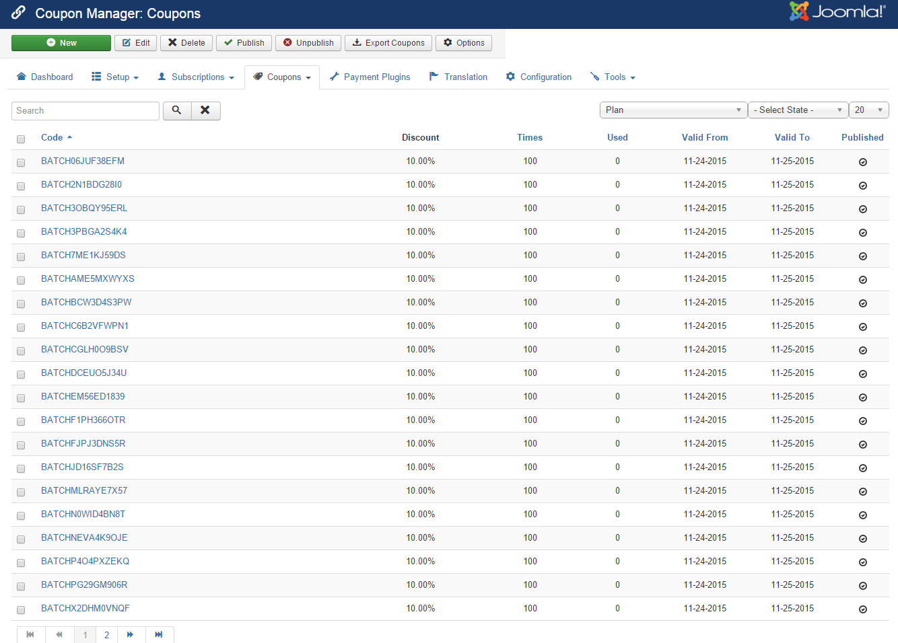
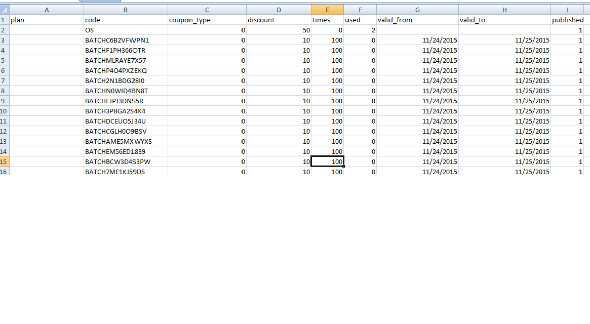

**Membership Pro** allows you to create coupon codes to give discount to your subscribers when they sign up for your subscription plan. 

To access to coupons management page, there are 3 different ways:
1. Access to **Components => Membership Pro => Coupons**
2. Access to Membership Pro Dashboard, then click on Coupons icon.
3. On any pages in Membership Pro, access to **Coupons** menu item

## Add New Coupon
Press **New** button to create new coupon

1. **Code**: The code for this new coupon.
2. **Discount**: Enter the discount for this coupon. Discount can be set to a fixed amount (for example 10$) ro by percent (for example 10% of subscription fee).
3. **Plan**: Choose the subscription plan which this coupon code can be used. Choose **All plans** if you want this coupon code can be used for any subscription plans.
4. **Times**: Enter number of times this coupon code can be used. If you leave it empty, the coupon code can be used unlimited times.
5. **Valid From Date**: If you choose a date, the coupon code can only be used **from the selected date**.
6. **Valid To Date**: If you chose a date, the coupon code can only be used before the selected date. After that date, the coupon code cannot be used anymore.

## Export Coupons

**Membership Pro** allows you to export coupons into a csv file so that you can import these coupons into another system if needed. Or you might just want to use the csv file for reporting purpose

To export coupons, from any pages in Membership Pro, access to Coupons => Export Coupon sub-menu. A csv file will be generated and downloaded to your computer. Below is the screenshow of a sample csv file exported by Membership Pro

## Import Coupons

**Membership Pro** allows you to import existing coupon codes from a csv file into the system. This is helpful in case you have coupons generated by other system and want to import it into Memebrship Pro

### Prepare the csv file
To be imported into Membership Pro, the csv file contains coupon code need to be formatted in a required format. The easiest way is you the **Export Coupons** feature above to get a sample of the CSV file. Below are the meaning of the columns in csv file:
1. **plan**: This column contains title of the plan. If it is empty, the coupon code will be assigned to all plans.
2. **code**: The coupon code
3. **coupon_type**: 0 mean discount type is percent. 1 mean discount type is fixed amount.
4. **discount**: The discount amount
5. **times**: Number of times the coupon code can be used. 0 means it can be used unlimited time
6. **valid_from**: The Valid From Date of the coupon. The date must be in YYYY-MM-DD format or you can leave it empty.
7. **valid_to**: The Valid To Date of the coupon. The date must be in YYYY-MM-DD format or you can leave it empty.
8. **published**: The coupon code is published or not

### Run the import

When you have the csv file contains the coupon codes ready, please follow the steps below to get the coupon code imported into the system:
1. Access to **Coupons => Import Coupons **sub-menu item.
2. Click on **Choose File** button to select the csv file.
3. Press **Import Coupons** button in the toolbar to process the import.

After that, the coupon codes in the csv file will be imported and can be used in the system

## Batch Coupons

This is a very useful feature of Membership Pro. It allows you to create many coupons code at a time without having to enter these coupon codes manully.

From any page in Membership Pro, you can access to **Coupons => Batch Coupons** sub menu item. The form below will be displayed to allow you to generate batch coupons

1. **Number Coupons**: Enter number of coupons you want the system to create. For example, 100, 500....
2. **Plan**: Choose the subscription plan which this coupon code can be used. Choose **All plans** if you want this coupon code can be used for any subscription plans.
3. **Discount**: Enter the discount for the coupons. Discount can be set to a fixed amount (for example 10$) ro by percent (for example 10% of subscription fee).
4. **Characters set**: The characters set will be used to create these coupons. When generating coupon code, the system will get random character from this characters set. You can leave this empty and the system will use this characters set **ABCDEFGHIJKLMNOPQRSTUVWXYZ0123456789**
5. **Prefix**: If you want these coupons code has a fixed prefix, enter the prefix you want here, otherwise, leave it empty
6. **Coupon Length**: The length of the generated coupon codes. Enter an integer number, for example, if you want the coupon code to have 10 characters, enter 10 into this field
7. **Valid From Date**: If you choose a date, the coupon codes can only be used **from the selected date**.
8. **Valid To Date**: If you chose a date, the coupon code can only be used before the selected date. After that date, the coupon code cannot be used anymore.
9. **Times**: Enter number of times these coupon codes can be used. If you leave it empty, the coupon code can be used unlimited times.

After enter all the necessary settings, press **Generate Coupons** button in the toolbar and the coupon codes will be generated, ready to use in your system

