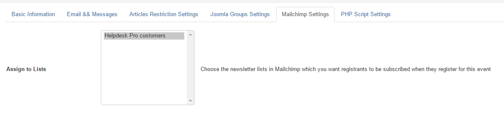

Membership has plugins allow you to assign subscribers into mailing lists so that you can send newsletters to them whenever you want.

At the moment, Membership Pro supports [**ACYMailing**](https://www.acyba.com/) (a popular Joomla newsletter extension) and [Mailchimp](http://mailchimp.com/) (a popular email online marketting service)

## ACYMailing integration
This feature only works if you are using **ACYMailing** extension on your site. If you don't use **ACYMailing** extension, please ignore this section

1. Go to Extensions -> Plugins Manager, find and publish the plugin **OS Membership - Acymailing plugin**
2. Now, when you add/edit a subscription plan, you will see a new tab called **Acymailing Settings**. Choose the Mailing Lists you want subscribers of this plan will be assigned to in **Newsletter Lists**

After that, when users sign up for this subscription plan, they will be assigned to the selected mailing lists and you can use ACYMailing to send newsletter to them in the future.

## Mailchim Integration

1. Go to Extensions -> Plugins Manager, find and publish the plugin **Membership Pro - Mailchimp plugin**
2. Get the **API Key** of your Mailchimp account (you can see instructions at [http://kb.mailchimp.com/accounts/management/about-api-keys](http://kb.mailchimp.com/accounts/management/about-api-keys), **enter it into API key of the plugin parameter**.
3. Now, when you add/edit a subscription plan, you will see a new tab called **Mailchimp Settings**. Choose the Mailing Lists you want subscribers of this plan will be assigned to in **Assign to Lists** parameter

After that, when users sign up for this subscription plan, they will be assigned to the selected mailing lists and you can use **Mailchimp** to send newsletter to them in the future.

